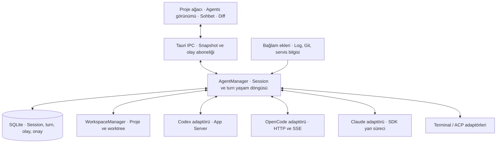

# RunHQ birleşik agent çalışma alanı

## 15 Eylül 2026 uygulama güncellemesi

Aşağıdaki analiz, 13 Eylül 2026 tarihli ilk mimari değerlendirmedir; gelecek zamanlı öneriler o başlangıç durumunu anlatır. Güncel kullanım ve destek matrisi [Agent çalışma alanı](AGENT_WORKSPACE.md) belgesindedir. İlk analiz ve diğer alanlara ilişkin gerekçeler tarihsel kayıt olarak korunmuştur.

Artık kalıcı agent oturumlarına ek olarak şu akışlar uygulanmıştır:

- **Mission Control:** gerçek görev durumlarından üretilen müdahale/çalışan/hazır/tamamlanan sütunları, durum filtreleri ve gönderilmeden önce düzenlenebilen görev şablonları.
- **Plan:** sağlayıcı planını veya plan yanıtını inceleme, yerelde düzenleme ve seçilen metinle aynı konuşmada gerçek uygulama turu başlatma.
- **Cursor ACP:** `agent acp`, keşfedilen Agent/Plan/Ask modları, native plan onayı, seçenek kimliklerini koruyan sorular, todo ve alt-agent bildirimleri. Kurulu CLI alt komutu doğrulandı; canlı kimlik doğrulama başarısız olduğundan gerçek Cursor model turu doğrulanmadı.
- **Canvas:** tamamlanmış HTML/SVG/Markdown kod bloklarından önizleme, kaynak düzenleme ve taşınabilir dosya çıktısı. Bu RunHQ özelliği Cursor'ın native Canvas kayıtlarını veya paylaşılan URL'lerini içe aktarmaz.
- **Mesaj kuyruğu:** sekmeler arasında devam eden sıralı gönderim; hata, kesinti veya Stop sonrası bekleme ve açık devam eylemi. Uygulama kapandığında/arayüz yeniden yüklendiğinde gönderilmemiş kuyruk temizlenir.

Araştırma kaynakları: [Cursor ACP](https://cursor.com/docs/cli/acp), [Cursor Canvases](https://cursor.com/docs/agent/tools/canvas), [Cursor Plan Mode](https://cursor.com/blog/plan-mode), [Claude Code agent teams](https://code.claude.com/docs/en/agent-teams). Bu kapsam bütün ürünlerle özellik eşitliği veya Claude SDK içinde native agent teams/teammate mesajlaşması sunulduğu iddiası taşımaz; CLI kurulumu, uyumluluğu ve kimlik doğrulaması sağlayıcının gereksinimleridir.

## Karar

RunHQ, kayıtlı projelerin altında Codex, OpenCode ve Claude tabanlı çalışma oturumlarını bir araya getiren bir agent çalışma alanına dönüştürülebilir. Mevcut Tauri/Rust/React yapısı bunun için uygundur. Proje keşfi, servis çalıştırma, terminal, Git inceleme ve sohbet bileşenleri önemli bir başlangıç sağlar. Asıl yeni yatırım; agent süreçlerinin yaşam döngüsünü, kalıcı oturumlarını, onaylarını ve olay akışlarını yöneten arka uç katmanıdır.

İlk ürün kapsamı: projeler, agent sohbetleri, bütün projelerde canlı durum, terminal, değişiklik inceleme ve gerektiğinde mevcut editöre geçiş. Tam kod editörü, dil sunucuları ve debugger bu kapsamın dışında ayrı bir ürün yatırımıdır.

Teknik öneri: sağlayıcıya özgü entegrasyonları ortak bir `AgentSession` modeli altında toplamak. Desteklenen özellikler ortak arayüzde görünür; sağlayıcının özel seçenekleri ayrıca korunur. Her CLI için bütün özelliklerin aynı anda ve birebir sunulacağı sözü verilmemelidir.

Bu değerlendirme 13 Eylül 2026 tarihinde `96d6cec` commit'indeki kaynak kod, yerel CLI sürüm/yardım çıktıları ve resmî entegrasyon belgelerine dayanır. Canlı model isteği, hesap girişi, gerçek dosya düzenleyen agent çalıştırması veya uçtan uca entegrasyon testi yapılmadı. Dolayısıyla mimari uygulanabilirlik doğrulandı; hesap ve sürüm bazında çalışma garantisi henüz doğrulanmadı.

## Ürün deneyimi

Sol tarafta projeler kalır. Her proje, servislerini ve agent oturumlarını gösterir. Örneğin aynı projede “giriş hatasını düzelt” adlı Codex oturumu ile “değişiklikleri incele” adlı OpenCode oturumu bulunabilir. Servislerin ayakta olması, agent oturumunu açmanın ön koşulu değildir.

Ortada seçili agent oturumu açılır: sohbet, araç faaliyetleri, değişen dosyalar, kullanıcıdan beklenen karar ve mesaj yazma alanı. Başlıkta proje, çalışma dizini/branch, agent ve model görünür. Terminal ve diff aynı oturumun bağlamında açılır. Editöre geçiş, özellikle worktree kullanılıyorsa, doğru çalışma dizinini hedefler.

Üst düzey “Agents” görünümü bütün projelerdeki işleri bir araya getirir. Her satırda proje, görev, agent/model, durum, son etkinlik, beklenen kullanıcı eylemi ve okunmamış sonuç yer alır. İlk açılışta müdahale bekleyen işler öne çıkar. Örnek durumlar:

| Proje  | Oturum                  | Durum                 | Kullanıcının yapacağı iş        |
| ------ | ----------------------- | --------------------- | ------------------------------- |
| API    | Giriş hatasını düzelt   | Test komutu çalışıyor | Gerekirse oturuma gir           |
| Web    | Menü bileşenini düzenle | Komut onayı bekliyor  | Komutu ve dizini incele         |
| Worker | Kuyruk incelemesi       | Yanıt hazır           | Sonucu oku                      |
| CLI    | Dokümantasyon güncelle  | Bağlantı kesildi      | Oturum durumunu yeniden doğrula |

Bu tablo önerilen deneyimi anlatır; gerçek çalışan oturumları temsil etmez. Birden fazla sohbeti yan yana açmak yararlıdır, ancak bütün sohbetleri sürekli ekranda tutmak gerekmez. Portföy görünümü hangi işe bakılması gerektiğini söyler; ayrıntı görünümü o işi yürütür.

Sekmeyi kapatma yalnızca görünümü kapatır. “Durdur” aktif agent turunu keser. “Arşivle” oturumu listeden kaldırır. Bu eylemlerin ayrı olması, farklı ekranlar arasında geçiş yaparken iş kaybetmemek için temel bir davranış sözleşmesidir.

## Mevcut kodun sağladıkları ve boşluklar

| Alan               | Kodda görülen durum                                          | Yeni özellik için anlamı                                              |
| ------------------ | ------------------------------------------------------------ | --------------------------------------------------------------------- |
| Uygulama kabuğu    | React, Zustand, Tauri 2; ana sekmeler ve sağ panel           | Yeni çalışma alanı mevcut uygulamaya eklenebilir                      |
| Proje/servis kaydı | `ServiceDef`: kimlik, `cwd`, komutlar, ortam değişkenleri    | Servis ile kalıcı proje kimliğini ayırmak gerekir                     |
| Terminal           | `portable-pty`, xterm, giriş/çıkış ve resize                 | Yerel CLI terminal modu için iyi temel                                |
| Süreçler           | Servis supervisor'ı, durum ve kaynak olayları                | Süreç yardımcıları paylaşılabilir; agent'a ayrı yaşam döngüsü gerekir |
| AI sohbet          | OpenAI uyumlu Chat Completions, streaming, çoklu sekme       | Görsel bileşenler tekrar kullanılabilir; coding-agent motoru değildir |
| Geçmiş             | SQLite konuşmalar ve mesajlar                                | Agent session/turn/tool/approval için ek şema gerekir                 |
| Git                | Status, diff, staging, commit, branch işlemleri; Monaco diff | Sonuç inceleme büyük ölçüde mevcut temele oturur                      |
| Araç keşfi         | GUI açılışında shell PATH kurtarma ve editör keşfi           | CLI bulma mekanizması için yararlı başlangıç                          |
| Pencere            | Ana pencere kapatılınca uygulama gizleniyor                  | Pencere kapanması ile uygulamadan çıkış farklı ele alınabilir         |

### 1. Mevcut AI provider, agent runtime ile aynı şey değil

`AiProvider`, `base_url`, `api_key` ve `model` üzerinden `/chat/completions` çağrısı oluşturuyor. Mevcut AI akışı açıklama ve sohbet üretiyor; CLI'ın dosya araçları, komut çalıştırma döngüsü, onay istekleri ve kendi oturum yönetimini kapsamıyor. Kaynaklar: [provider.rs](../crates/runhq-core/src/ai/provider.rs#L26), [AI streaming IPC](../apps/desktop/src-tauri/src/ipc/ai/streaming.rs#L15).

Öneri: `AiProvider` mevcut açıklama/triage işlevleri için kalabilir. Bunun yanına `AgentBackend` ve `AgentProfile` eklenmeli. OpenCode üzerinden bir Claude modeli çalıştırmak ile Claude Agent SDK kullanmak da farklı runtime seçenekleridir; model adı bu ayrımı ortadan kaldırmaz.

### 2. Proje bağlamı oturuma sabitlenmeli

Bugünkü sohbet bağlamı seçili servisten üretiliyor. Servis seçimi değiştiğinde bağlamdaki proje ve notlar değişebiliyor. Sohbet için anlaşılır olan bu davranış, dosya yazan agent oturumunun çalışma dizinini belirlemek için uygun değildir. Kaynaklar: [useAiChatContext.ts](../apps/desktop/src/components/ai/chat-panel/useAiChatContext.ts#L29), [mesaj geçmişi oluşturma](../apps/desktop/src/components/ai/chat-panel/useAiChatSending.ts#L146).

Agent oturumu oluşturulurken proje, checkout/worktree ve çalışma alt dizini kalıcı olarak bağlanmalı. Başka bir projeye tıklamak açık oturumun hedefini değiştirmemeli. Başka proje verisi eklenecekse açık bir bağlam eki olarak gösterilmeli.

### 3. Canlı durum panelin sahipliğinden çıkmalı

Sohbet mesajları ve aktif istekler `useAiChatState` içinde React state/ref olarak tutuluyor. Sağ AI paneli ilk açılıştan sonra mounted kalıyor; dolayısıyla yalnızca paneli gizlemenin sohbeti mutlaka durdurduğu söylenemez. Buna rağmen arka uçta yeniden bağlanılabilir bir agent oturum yöneticisi yok. Kaynaklar: [useAiChatState.ts](../apps/desktop/src/components/ai/chat-panel/useAiChatState.ts#L18), [RightSidePanel.tsx](../apps/desktop/src/components/RightSidePanel.tsx#L114).

Sohbet sekmesi sınırı beş. Store'daki ekleme/çıkarma politikası aktif sekmeyi koruyor, fakat devam eden bütün işlerin merkezi durumuna dayanan bir agent planlayıcısı değil. Kapalı sekmeler ve başka panellerdeki işler için ayrı bir global session store gerekli. Kaynaklar: [sekme limiti](../apps/desktop/src/store/runtime/appStorePanels.ts#L182), [aiChatSlice.ts](../apps/desktop/src/store/slices/aiChatSlice.ts#L24).

### 4. Durdurma gerçek bir arka uç işlemi olmalı

`cancelFor`, istek kimliğini değiştirip gelen parçaları geçersiz sayıyor. Arka uç için iptal komutu göndermiyor. Bu yaklaşım coding-agent çalışırken “Durdur” güvencesi veremez. Kaynak: [useAiStreamRunner.ts](../apps/desktop/src/components/ai/chat-panel/useAiStreamRunner.ts#L85).

Yeni akış: interrupt isteği gönderilir, durum “durduruluyor” olur, sağlayıcının bitiş olayı beklenir. Belirlenmiş süre içinde yanıt gelmezse yalnızca sahip olunan oturum/süreç için kontrollü sonlandırma sunulur. Durdurma yapılan değişiklikleri geri almak anlamına gelmez.

### 5. Terminalin yaşam döngüsü ayrılmalı

`TerminalPane` unmount olduğunda `terminalDestroy` çağırıyor. `TerminalManager` aynı kimlikle yeniden create edildiğinde eski terminali yok ediyor ve shell başlatıyor. Şu anki kanal ham byte taşımak için uygun; agent oturumu, onay veya araç kimliği taşımıyor. Kaynaklar: [TerminalPane.tsx](../apps/desktop/src/components/TerminalPane.tsx#L257), [manager.rs](../apps/desktop/src-tauri/src/terminal/manager.rs#L42), [terminal types](../apps/desktop/src-tauri/src/terminal/types.rs#L5).

Terminal yedek modu da `create/attach/detach/terminate` ayrımına ihtiyaç duyar. Native CLI deneyimini açmak kolaylaştırılabilir; buna bakarak güvenilir semantik görev durumu çıkarmak ayrı problemdir.

### 6. Git çekirdeği kullanılabilir, IPC hedeflemesi genişlemeli

Git çekirdeği dizin alıyor; mevcut IPC ise servis kimliğini `cwd`'ye çözümlüyor. Agent worktree'si servisin checkout'undan farklı olursa aynı servis kimliği yanlış diff'i açabilir. Yeni workspace hedefi kayıtlı `workspace_id` üzerinden arka uçta çözülmeli. Kaynaklar: [resolve_cwd](../apps/desktop/src-tauri/src/ipc.rs#L53), [git IPC](../apps/desktop/src-tauri/src/ipc/git.rs#L12).

## CLI entegrasyon seçenekleri

Yerel salt okunur kontrollerde görülen sürümler:

| Araç        | Sürüm     | Bu makinede çözülen çalıştırılabilir dosya           |
| ----------- | --------- | ---------------------------------------------------- |
| Codex       | `0.153.4` | `/Applications/ChatGPT.app/Contents/Resources/codex` |
| Claude Code | `2.1.119` | `/opt/homebrew/bin/claude`                           |
| OpenCode    | `1.18.30` | `~/.nvm/versions/node/v22.21.1/bin/opencode`         |

Bunlar ürünün sabit varsayımları olmamalı. Kullanıcıya bulunan yol ve sürüm gösterilmeli; başka executable seçilebilmeli. Özellikle uygulama paketinin içindeki Codex yolu güncellemeyle değişebilir. “Kurulu”, “giriş yapılmış”, “uyumlu protokol” ve “istenen modeli kullanabiliyor” ayrı doğrulamalardır.

### Codex

Resmî App Server, JSONL/stdio üzerinden initialize, thread, turn, olay, onay ve model keşfi sunuyor. `model/list` model ve reasoning seçeneklerini; `thread/resume` devamı; `turn/interrupt` iptali destekliyor. Yerel yardım çıktısında `app-server` mevcut ve experimental olarak işaretli. [OpenAI App Server belgesi](https://learn.chatgpt.com/docs/app-server).

Öneri: Rust'tan sahip olunan bir `codex app-server` süreci açıp protokolü adaptörde karşılamak. Başlangıçta stdio, ağ portu yönetimi gerektirmediği için tercih edilebilir. Üretimde desteklenen CLI sürüm aralığı ve protokol fixture'ları tutulmalı. Başka uygulamanın mevcut server'ını otomatik sahiplenmek yerine RunHQ'nun bağlantı ve süreç sahipliği açık olmalı.

### OpenCode

Resmî server API; oturum listeleme, durum, mesaj, asenkron prompt, iptal, diff, sağlayıcı/model bilgisi ve SSE olay akışına sahip. Yerel yardım çıktısı `serve`, `attach`, `models` ve `acp` komutlarını doğruluyor. [OpenCode Server belgesi](https://opencode.ai/docs/server/).

Öneri: RunHQ'nun yönettiği loopback server'ı Rust HTTP/SSE adaptörüyle kullanmak. Bağlantı kimliği, süreç sahipliği ve dizin bağlamı tutulmalı; server erişimi yalnız localhost olduğu varsayımıyla korumasız bırakılmamalı. Çoklu proje paylaşımı optimizasyonu, dizin/config izolasyonu doğrulandıktan sonra yapılmalı. JS SDK da seçenek, ancak yalnız bu entegrasyon için Node katmanı zorunlu değil. [OpenCode SDK belgesi](https://opencode.ai/docs/sdk/).

### Claude

CLI, `-p` ve JSON/stream-json çıktı ile programatik kullanım sunuyor. Yerel sürümde model, effort, resume, fork ve streaming seçenekleri görüldü. Bu, tek seferlik otomasyon için somut bir başlangıçtır; sadece çıktı akışının bulunması bütün etkileşimli onayların çözüldüğü anlamına gelmez. [Claude programatik kullanım belgesi](https://code.claude.com/docs/en/headless).

Agent SDK Python/TypeScript üzerinden araç döngüsü ve oturum yetenekleri sunar. `canUseTool` aracılığıyla onay ve kullanıcı sorusu RunHQ arayüzüne taşınabilir. Tercih edilen zengin entegrasyon, Rust'ın yönettiği küçük bir SDK yan süreci olabilir. Bu durumda Node/Python runtime paketlemesi, SDK sürümü ve yerel CLI uyumluluğu dağıtım işinin parçasıdır. [SDK genel bakış](https://code.claude.com/docs/en/agent-sdk/overview), [onay ve kullanıcı girdisi](https://code.claude.com/docs/en/agent-sdk/user-input).

SDK belgesi, önceden onay olmadan üçüncü taraf ürünlerde claude.ai girişinin veya rate limitlerinin sunulmasına izin verilmediğini belirtiyor. Bu nedenle özel RunHQ sohbeti için mevcut Claude aboneliğinin otomatik kullanılacağı vaat edilmemeli; desteklenen API anahtarı akışı ya da onaylı entegrasyon yolu planlanmalı. Yerel CLI terminalini açmak teknik olarak farklı bir moddur; bu seçenek söz konusu kısıtı aşma yöntemi olarak sunulmamalı. [Anthropic SDK kimlik doğrulama açıklaması](https://code.claude.com/docs/en/agent-sdk/overview).

### ACP ve diğer CLI'lar

OpenCode, `opencode acp` ile stdio/JSON-RPC tabanlı Agent Client Protocol desteği sunuyor. Ancak kendi dokümanı `/undo` ve `/redo` gibi bazı komutların desteklenmediğini de belirtiyor. Bu bile “bir ortak protokol = bütün özellikler” varsayımının yeterli olmadığını gösteriyor. [OpenCode ACP belgesi](https://opencode.ai/docs/acp/).

Öneri: ACP'yi genişleyebilir bir adaptör türü olarak tutmak; ilk üç backend'i sırf tek protokol kullanmak için ek dönüştürücülere zorlamamak. MCP ise araç/bağlam entegrasyonu katmanıdır; agent oturumu ve kullanıcı arayüzü protokolünün yerine konmamalı. Diğer CLI'lar başlangıçta terminal modu ile eklenebilir, zengin durum için yapılandırılmış protokol veya açık bir adaptör gerekir.

## “Tüm destek” için uygulanabilir sözleşme

Tek bir model dropdown'ı yeterli değildir. Seçim sırası agent runtime → runtime'ın desteklediği provider → model → varsa effort/variant olmalı. Varsayılanlar uygulama ve proje düzeyinde seçilebilir; oturumun gerçek seçimleri ayrıca saklanır. Devam eden turda değişiklik desteklenmiyorsa seçim bir sonraki tura uygulanır ve arayüz bunu belirtir.

| Yetenek                   | Ortak davranış                          | Sağlayıcı farkı                               |
| ------------------------- | --------------------------------------- | --------------------------------------------- |
| Mesaj ve streaming        | Ortak sohbet ve olay görünümü           | Mesaj parçaları, araç blokları farklı         |
| Model seçimi              | Keşfedilen ve kullanılabilir seçenekler | Model listesi/auth/sürüm belirleyici          |
| Effort / variant          | Varsa seçilebilir                       | Evrensel low/medium/high eşlemesi yapılmaz    |
| Durdurma                  | Aktif turun gerçek iptali               | Protokol ve alt süreç davranışı farklı        |
| Onay ve soru              | Aynı müdahale kuyruğu                   | Karar türleri ve kalıcılık kapsamı farklı     |
| Resume / fork             | Destek varsa açık eylem                 | Aynı backend'in oturum kimliğiyle             |
| MCP, skills, agent seçimi | Sağlayıcıya özgü ayarlar                | Konfigürasyonlar körlemesine birleştirilmez   |
| Token, maliyet, bağlam    | Bildirilen değer ve kaynağı gösterilir  | Eksik veri sıfır sayılmaz; tahmin etiketlenir |
| Alt agent'lar             | Bildirilen parent-child ilişkisi        | Her backend aynı ayrıntıyı vermeyebilir       |
| Terminal modu             | CLI'ın kendi etkileşimli ekranı         | Güvenilir semantik durum garantisi yok        |

`AgentCapabilities` yalnız boolean bir liste olmamalı: bir özelliğin destek seviyesi, izin verilen değerleri ve session/turn kapsamı bulunmalı. Örneğin `modelChangeScope: next_turn` veya `resume: native` gibi bilgiler UI'ın yanlış seçenek sunmasını engeller. Bilinmeyen yeni olaylar bütün oturumu bozmak yerine sürümlenmiş bir “desteklenmeyen olay” kaydı olarak tutulabilir.

Bir Codex oturumunu Claude'a geçirmek aynı oturumu sürdürmek değildir. Bağlam özeti, ilgili dosyalar ve görev hedefiyle yeni oturum başlatılabilir; özgün araç geçmişi, bellek ve izin durumu birebir taşınmış sayılmaz. Claude içinde resume/fork desteği de kendi session kimliği üzerinden işler. [Claude sessions belgesi](https://code.claude.com/docs/en/agent-sdk/sessions).

## Önerilen mimari



### Kimlik ve veri modeli

`Project`, servislerden bağımsız kalıcı kimliktir. `Workspace`, proje üzerinde fiziksel bir checkout/worktree'yi temsil eder. `AgentSession`, çalışma dizini ve backend'e bağlı sohbeti; `AgentTurn`, bir gönderimden doğan çalışma döngüsünü temsil eder. `AgentItem` ise mesaj, komut, dosya değişikliği veya soru gibi zaman çizelgesi öğesidir.

Önerilen alanlar:

```text
Project
  id, display_name, root_path, repository_identity?, service_links[]

Workspace
  id, project_id, canonical_path, kind, branch?, base_commit?, ownership

AgentSession
  id, project_id, workspace_id, working_subdir, backend_id, backend_version
  native_session_id?, title, model_selection, permission_profile
  transport_state, active_turn_id?, parent_session_id?, archived_at?

AgentTurn
  id, session_id, client_request_id, native_turn_id?, status
  requested_model, actual_model?, started_at, finished_at?, usage?, error?

AgentEvent
  session_id, local_seq, provider_event_id?, turn_id?, item_id?
  schema_version, event_type, timestamp, payload

PendingRequest
  id, session_id, turn_id, native_request_id, kind, payload
  state, decision?, resolved_at?
```

`repository_identity` tek başına remote URL olmamalı; aynı repo'nun farklı klonları ve worktree'leri olabilir. Proje UUID'si kalıcı kalır; path yeniden eşleme ayrı bir işlemdir. Monorepo alt dizinleri ve Git olmayan klasörler de desteklenmeli. Canonical path, Git kökü/common-dir ve kullanıcının kayıt yapısı birlikte değerlendirilir.

Migration, mevcut servisleri silmeden proje bağlantıları oluşturmalı. Aynı klasörü kullanan servisleri gruplamakla, bütün monorepo alt projelerini otomatik tek ürün saymak farklı kararlardır. Git olmayan ve komutu bulunmayan bir klasör de agent projesi olarak eklenebilmelidir.

Konuşma tabloları bugün proje/native session/turn/approval alanları taşımıyor ve mesaj rolleri user/assistant ile sınırlı. Yeni agent tablolarını ayrı `agents.db` içinde sürümlü migration'larla tutmak ilk aşamada mevcut geçmişi korumayı kolaylaştırır. Eski sohbetleri backend oturumuymuş gibi otomatik dönüştürmek yerine, seçili mesajları yeni göreve bağlam olarak eklemek daha açık bir geçiştir. Kaynaklar: [mevcut şema](../crates/runhq-core/src/conversations/db.rs#L29), [mesaj türleri](../crates/runhq-core/src/conversations/types.rs#L59).

### Süreç ve API sahipliği

`AgentManager`, React'tan bağımsız olarak Rust/Tokio tarafında yaşamalı. Backend protokolü parse edilir, ortak olaylara dönüştürülür, kalıcı durum güncellenir ve UI'a yayınlanır. UI kapanan bir bileşenden sonra aynı session'a tekrar abone olabilir.

İlk sürümde çalışma zamanı Tauri uygulama sürecinin içinde olabilir. Ana pencereyi gizlemek çalışmayı sürdürür; uygulamadan tamamen çıkış ise ayrı kapatma politikası ister. Uygulama kapalıyken veya çöktükten sonra işlerin kesintisiz sürmesi isteniyorsa bağımsız yerel daemon ve yeniden bağlanma protokolü gerekir. Veritabanına sohbet kaydetmek bu güvencenin yerine geçmez. Kaynak: [pencere kapatma davranışı](../apps/desktop/src-tauri/src/window.rs#L24).

Önerilen IPC yüzeyi: `detect_backends`, `get_capabilities`, `list_models`, `create_session`, `start_turn`, `interrupt_turn`, `respond_to_request`, `get_session_snapshot`, `subscribe_session_events`, `list_session_summaries`, `archive_session`. Backend destekliyorsa `steer_turn`, `resume_session` ve `fork_session` eklenir. IPC session/workspace kimliğini doğrular; UI'dan gelen rastgele path/command doğrudan yetkili işlem sayılmaz.

Mevcut servis supervisor'ının restart/health mantığı agent'a otomatik uygulanmamalı. Bir agent isteğini süreç düştü diye yeniden göndermek aynı komutu veya dosya değişikliğini iki kez çalıştırabilir. Spawn, process-group ve kaynak ölçüm yardımcıları paylaşılabilir; oturum politikası ayrı kalmalı.

### Canlı durum ve yeniden bağlanma

Durum üç eksende tutulmalı: bağlantı, aktif tur ve kullanıcının dikkat gereksinimi. Örneğin bağlantısı kopan bir session'ın son bilinen turu hâlâ çalışıyor olabilir; bunu doğrudan “başarısız” yapmak doğru değildir.

Tur durumları: `queued`, `starting`, `running`, `waiting_permission`, `waiting_input`, `cancelling`, `completed`, `failed`, `cancelled`, `interrupted`. Birden çok eşzamanlı araç isteği varsa tek bir onay bayrağı yerine bekleyen istek kümesi tutulur. Özet durum bu kümeden türetilir.

“Thinking”, “komut çalıştırıyor” ve “dosya düzenliyor” gibi faaliyetler sağlayıcının yayımladığı olaylara dayanmalı. Ham düşünce içeriğine ihtiyaç yoktur. Sürecin CPU kullanımı veya terminalde bir süre yazı görünmemesi, turun bittiğinin kanıtı değildir. “Yanıt hazır” da testlerin geçtiği veya kullanıcı hedefinin başarıyla tamamlandığı anlamına gelmez; sonuç ve doğrulama ayrı gösterilir.

UI yeniden açıldığında önce snapshot ve cursor alır, ardından olaylara abone olur. Snapshot ile abonelik arasında kaçan olayları replay edecek atomik handoff veya buffer gerekir. Yerel sıra numarası RunHQ içi replay sağlar; sağlayıcı bağlantısı kesilirken kaçan olaylar için ayrıca native session snapshot/transcript ile uzlaştırma gerekir. Sağlayıcı geçmişi desteklemiyorsa boşluk açıkça işaretlenir.

Mesaj gönderiminde `client_request_id`, kabul sonucu ve native turn kimliği eşleştirilir. Yanıt alınamayan bir gönderim otomatik tekrar edilmeden önce sağlayıcı durumu kontrol edilir. Onay yanıtı doğru session/turn/request kimliğine gider; eski veya iptal olmuş isteğe verilen yanıt yeni isteği onaylayamaz.

### Performans

Her eklenen proje için hemen CLI başlatılmamalı. Oturum açıldığında runtime oluşturulur; idle süreçler backend'in resume güvencesine göre tutulur veya kapatılır. Aynı session için varsayılan tek aktif tur, toplamda yapılandırılabilir eşzamanlılık sınırı kullanılır.

Portföy görünümü bütün mesaj gövdelerine değil, hafif session özetlerine abone olmalı. Token delta'ları kısa aralıklarla toplu render edilir; araç/onay/bitiş olayları geciktirilmez. Uzun geçmiş sayfalanır, büyük komut çıktıları sınırlandırılır ve gerekirse dosyada saklanır. SQLite için tek yazıcı kuyruğu, kısa transaction ve uygun WAL/busy-timeout politikası tasarlanır.

Mevcut terminal akışı 8 ms/32 KiB batch kullanıyor fakat iç kuyruğu sınırsız `mpsc::channel`. Bunu çok sayıda agent için doğrudan çoğaltmak yerine bellek sınırı ve geri basınç tasarımı gerekir. Kaynak: [terminal pipeline](../apps/desktop/src-tauri/src/terminal/pipeline.rs#L13).

RunHQ arayüzünün bellek tüketimi ile CLI alt süreçlerinin tüketimi ayrı raporlanmalı. Mevcut README'deki bellek iddiası bütün agent süreçlerini kapsayan yeni ürün güvencesi olarak kullanılmamalı; gerçek yük altında ölçüm gerekir.

## Aynı repoda birden fazla agent

Bir çalışma dizininde iki agent'ın eşzamanlı dosya yazması; çakışan edit, branch değişimi, Git index müdahalesi ve hangi değişikliğin hangi göreve ait olduğunun kaybı anlamına gelebilir. Sadece ayrı sohbet kimliği bunu çözmez.

İlk sürümde aynı workspace için tek yazıcı lease'i önerilir. Başka okuma oturumları açılabilir; ikinci yazıcı ya bekler ya da ayrı worktree ister. Bu koordinasyon RunHQ'nun yönettiği oturumlarla sınırlıdır: harici editör ve terminal aynı dosyaya yazabilir. Dosya değişiklikleri yeniden doğrulanmalı ve diff sahipliği kesinmiş gibi gösterilmemeli.

Gerçek paralel geliştirme için görev başına worktree uygun olur. Checkout oluşturma, branch, başlangıç commit'i, bağımlılık kurulumu, ortam dosyaları, port tahsisi ve temizleme ayrı workspace yaşam döngüsü olarak yönetilir. Worktree bir güvenlik sandbox'ı değildir; ortak Git metadata'sı ve harici servisler paylaşılabilir.

Git olmayan projelerde ilk aşamada tek yazıcı uygulanabilir. Klasör kopyalama veya başka izolasyon ancak açık ürün kapsamıyla eklenmeli.

Görev sonucunu inceleme; başlangıç snapshot'ı, sağlayıcının bildirdiği dosya değişiklikleri ve güncel Git diff'ini birlikte kullanmalı. Sadece `git diff HEAD` göstermek önceden var olan kullanıcı değişikliklerini de göreve mal edebilir. “Discard” gibi eylemler yalnız gerçekten seçilmiş değişikliklere uygulanmalı; agent bitince otomatik merge/commit yapılmamalı.

## Hesap, izin ve bağlam sınırları

Kimlik doğrulama backend'e göre yürümeli; token dosyaları ortak RunHQ provider JSON'una kopyalanmamalı. RunHQ'nun tutması gereken yeni sırlar için işletim sistemi secret store'u kullanılmalı. CLI executable'ın bulunması bir hesabın doğrulanması sayılmaz.

Yerel çalışma alanı, kullanılan modelin de yerel olduğu anlamına gelmez. Bulut backend seçildiğinde hangi proje ve eklerin gönderildiği kullanıcı tarafından anlaşılmalı. Log/context ekleri boyut sınırı ve sır ayıklama üzerinden hazırlanmalı; bütün `.env` veya süreç ortamı otomatik eklenmemeli.

İzin seçenekleri sağlayıcının gerçek anlamını korumalı. Evrensel bir “otomatik” seçeneğini bütün backend'lerde izin atlamaya çevirmek doğru olmaz. Bekleyen onayda komut/araç, hedef dizin, dosya kapsamı ve kararın süresi gösterilir. Normal sohbet yanıtı, tool approval yerine yorumlanmaz.

Tauri pencere yetkileri, başlatılmış CLI'ın dosya sistemi yetkilerini kendiliğinden sınırlandırmaz. Dosya ve ağ erişimi sağlayıcının sandbox/izin mekanizması ve gerektiğinde işletim sistemi izolasyonuyla ele alınır. Tool sonucu ve Markdown güvenilmeyen içerik olarak render edilir; bilinmeyen HTML ya da URL yerel komut tetikleyemez.

## Mevcut uygulamaya ekleme planı

Önerilen yeni modüller; bunlar henüz oluşturulmuş uygulama kodu değildir:

| Yer                                          | Sorumluluk                                                 |
| -------------------------------------------- | ---------------------------------------------------------- |
| `crates/runhq-core/src/agents/`              | Session, turn, capabilities, adaptörler, olaylar, depolama |
| `crates/runhq-core/src/workspaces/`          | Proje kimliği, checkout ve worktree yaşam döngüsü          |
| `apps/desktop/src-tauri/src/ipc/agents.rs`   | Tipli agent komutları ve abonelikler                       |
| `apps/desktop/src/store/` içinde agent store | Bütün session özetleri ve seçili ayrıntı                   |
| `apps/desktop/src/components/agents/`        | Global liste, proje oturumları, sohbet, onay, faaliyet     |
| `packages/cockpit-types/src/agentTypes.ts`   | Ortak IPC veri türleri                                     |
| `packages/cockpit-ui/src/`                   | İki uygulamada da gereken sunum bileşenleri                |
| Gerekiyorsa yeni bridge paketi               | Claude SDK yan süreci ve paketleme                         |

`AppState`'e agent/workspace yöneticileri eklenir; `MainTabKind` ve `AppShell` agent görünümleri için genişletilir. Yeni akış, mevcut açıklama/triage sohbetini tek adımda kaldırmayı gerektirmez. Log, CVE veya diff üzerindeki “Agent ile ele al” eylemi yeni görev taslağı oluşturabilir. Runtime başlatma kullanıcı görevi gönderdiğinde gerçekleşir. Kaynaklar: [AppState](../apps/desktop/src-tauri/src/app_state.rs#L62), [mainTabTypes](../apps/desktop/src/store/types/mainTabTypes.ts#L18), [AppShell](../apps/desktop/src/components/app/AppShell.tsx).

### Aşama 0 — Entegrasyon deneyi

Her backend için geçici test projesinde başlatma, model seçimi, mesaj, araç olayı, onay/soru, iptal ve aynı oturuma devam akışı doğrulanır. Özellikle Claude kimlik doğrulama/paketleme yolu ve kurulu sürüm ile SDK uyumu netleşir. Bu aşamanın çıktısı, desteklenen sürümlere bağlı gerçek yetenek matrisi ve protokol örnekleridir.

### Aşama 1 — Kullanılabilir çekirdek

Proje/workspace/session kimlikleri, SQLite kayıtları, Rust AgentManager, global durum listesi ve proje altındaki oturumlar eklenir. Bir backend ile baştan sona mesaj → araç/onay → sonuç → devam döngüsü teslim edilir. Önerilen başlangıç Codex App Server'dır; ardından OpenCode ile soyutlamanın gerçekten taşınabilir olduğu sınanır.

Bu aşamada aynı workspace'te tek aktif yazıcı bulunur. Sekme kapama işi kesmez; interrupt gerçek çalışmayı hedefler. UI yeniden yüklenince açık işler snapshot üzerinden geri gelir. Uygulamadan tam çıkışta sessizce yeniden çalıştırma yapılmaz.

### Aşama 2 — Çoklu backend beta

OpenCode ve Claude entegrasyonları, backend'e özgü ayarlar, geçmişe devam, onay kuyruğu ve birden çok projede eşzamanlı çalışma tamamlanır. Terminal yedek modu eklenir. Özel sohbet desteği ile terminal desteği UI'da ayrı seviyeler olarak görünür.

### Aşama 3 — Paralel geliştirme

Worktree oluşturma, görev bazında servis/terminal hedefleme, port ve ortam hazırlığı, diff sahipliği, sonuç aktarma ve cleanup eklenir. Kullanıcı burada aynı repo üzerinde gerçekten bağımsız işler yürütebilir. Dosya rollback'i ile sohbet geçmişinden geri alma ayrı eylemler olarak kalır.

### Aşama 4 — Dayanıklılık ve ürünleştirme

Gereksinime göre bağımsız daemon, uyku/uyanma ve crash recovery, native bildirimler, yük testleri, Windows/Linux uyumluluğu ve sürüm uyumluluk politikası tamamlanır. RunHQ dışında başlamış oturumların keşfi/ithali ancak sağlayıcıların desteklediği yollar ölçüsünde eklenir. Mevcut bir terminal sürecinin canlı kontrolünü devralmak, geçmişini okumakla aynı şey değildir.

### Efor beklentisi

Bu bir UI sekmesi ekleme işi değildir. Kabaca, projeye hâkim tek geliştirici ve mevcut test altyapısını geliştirme varsayımıyla: entegrasyon deneyi 3–5 iş günü, tek backend'li kullanılabilir çekirdek 2–4 hafta, üç backend'li beta için ilave 3–5 hafta, worktree ve dayanıklılık için ilave 3–6 hafta düşünülebilir. Bunlar ölçülmüş teslim tarihleri değildir; auth, SDK dağıtımı, kapsam ve platform testleri sonucu önemli ölçüde değişebilir. Tahmin entegrasyon deneyinden sonra yeniden yapılmalı.

## Kabul kriterleri

1. A projesinin oturumu açıkken B projesine geçmek A'nın `cwd`, model veya izinlerini değiştirmez.
2. İki ayrı projede çalışma başlatıldığında bütün durumlar global listede görünür; birinin onayı diğerine gitmez.
3. Sekmeyi/paneli kapamak işi durdurmaz. UI reload sonrası mesaj, araç durumu ve bekleyen onay geri gelir.
4. Interrupt gerçek turu durdurur; sonlandırma doğrulanmadan UI “durduruldu” demez.
5. Kayıp/tekrarlı/sırası değişmiş olaylar transcript'i bozmaz. Belirsiz gönderim otomatik ikinci kez çalıştırılmaz.
6. CLI çökmesi veya uyku sonrası bağlantı kaybında son bilinen durum korunur; yeniden bağlanma sağlayıcı verisiyle uzlaştırılır.
7. Aynı workspace'e ikinci yazıcı belirlenen lease/worktree politikasına uyar. Harici dosya değişiklikleri agent'a aitmiş gibi sunulmaz.
8. Desteklenmeyen model/effort seçeneği gönderilmez. Model değişiminin hangi tura uygulandığı görünür.
9. Büyük araç çıktısı ve en az 10 etkin oturum senaryosunda bellek/IPC/render davranışı ölçülür; eşik donanım taban çizgisine göre belirlenir.
10. Ana uygulama gizleme, tam çıkış ve yeniden başlatma birbirinden ayrı test edilir. Sahipsiz süreçler ve eski onaylar tespit edilir.
11. Mevcut servis, terminal, AI triage ve Git akışları çalışmaya devam eder. Gerekli doğrulamalar `pnpm typecheck`, `pnpm lint`, Rust testleri ve adaptör sözleşme testleriyle yapılır.

Bu analiz yalnız dokümantasyon değişikliğidir; yukarıdaki uygulama kabul testleri bu çalışma sırasında çalıştırılmadı.

## Açık kalan doğrulamalar

- Her backend'in yerel hesapla gerçek model listesi ve oturum başlatma yetkisi.
- Claude özel UI entegrasyonunun desteklenen kimlik doğrulama ve dağıtım şekli; terminal modu ile kapsam farkı.
- Seçilen CLI/SDK sürümlerinde bütün onay, soru, iptal ve yeniden bağlanma olaylarının ayrıntısı.
- App Server/OpenCode süreç paylaşımının farklı proje config ve çalışma dizinlerini nasıl izole ettiği.
- RunHQ dışında başlayan oturumların hangi backend'de güvenilir şekilde listelenip sürdürülebildiği.
- Üç işletim sisteminde süreç ağacı durdurma, shell PATH ve native paketleme davranışı.
- Gerçek eşzamanlı yükte bellek tüketimi ve UI gecikmesi.

Bu konular yapılabilirlik sonucunu ortadan kaldırmıyor; ürünün vereceği garanti seviyesini ve ilk teslim kapsamını belirliyor.

## Kaynaklar

Yerel kanıt: `96d6cec` kaynak kodu, `package.json`/Cargo bağımlılıkları, `command -v` sonuçları ve CLI `--version`/`--help` çıktıları. Kod bağlantıları ilgili bulguların yanında verilmiştir. Web kaynakları 13 Eylül 2026 tarihinde incelenmiştir; yayımlanma tarihi olmayan sayfalar için tarih varsayılmamıştır.

1. OpenAI, [Codex App Server](https://learn.chatgpt.com/docs/app-server): protokol, model keşfi, thread/turn, olay ve iptal.
2. OpenCode, [Server](https://opencode.ai/docs/server/): HTTP API, session işlemleri, sağlayıcı bilgisi ve SSE.
3. OpenCode, [SDK](https://opencode.ai/docs/sdk/): server istemcisi ve bağlantı seçenekleri.
4. OpenCode, [ACP Support](https://opencode.ai/docs/acp/): stdio entegrasyonu ve destek sınırları.
5. Anthropic, [Run Claude Code programmatically](https://code.claude.com/docs/en/headless): CLI streaming ve programatik kullanım.
6. Anthropic, [Agent SDK overview](https://code.claude.com/docs/en/agent-sdk/overview): SDK kapsamı, kimlik doğrulama sınırı ve dağıtım yaklaşımı.
7. Anthropic, [Handle approvals and user input](https://code.claude.com/docs/en/agent-sdk/user-input): onay ve soru callback'leri.
8. Anthropic, [Work with sessions](https://code.claude.com/docs/en/agent-sdk/sessions): session kimliği, resume ve fork.
